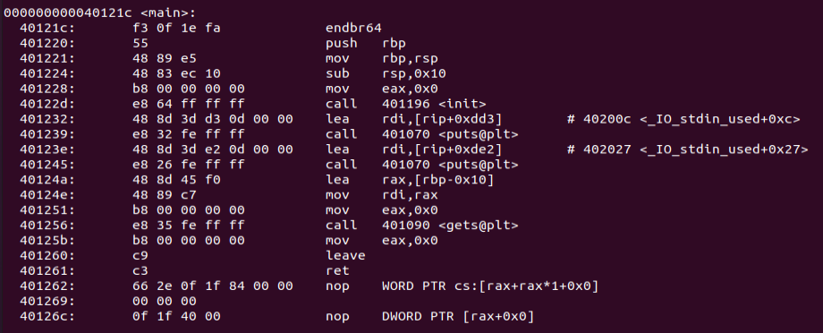

# 1. helloctf

## Writeup

(1) **gets@plt** 程式接受使用者 input，且 gets 沒有管控輸入長度 → buffer overflow 關鍵

(2) 401224:    48 83 ec 10        sub      rsp, 0x10   
→ main 開的 stack 有 0x10 + 預留 0x8 的空間
→ 總共是 0x18 的大小，因為 0x18 是 16 進位，所以換算為 24
→ 使用者輸入超過 24 個長度的字元的話 buffer overflow
