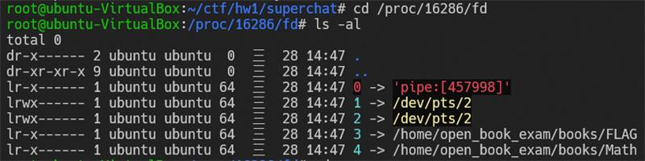
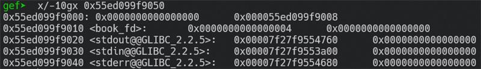
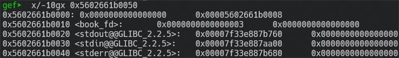

# 3. open_book_exam

## Writeup

### Steps

1. 先選一次 open file，並且選擇開啟 flag file，因此我們的 proc/process_id/fd 中就會記錄這筆 fd = 3。
    
    
    
2. 再選擇一次 open file，因為目前 cur_book 為”FLAG”，因此在 read_book() 的函式會進入 else if 的判斷條件，為了避免此問題，我們必須再隨便開啟一個不為 FLAG 的 book。
    
    
    
3. 開啟完2次書以後，我們透過 question array 找到 book_fd 的 address，此時 book_fd = 4，因為我們已經開了第二次書，為了能讓 book_fd = 3，我們透過 write_ans() 這個 function 從 question array 寫入 book_fd (從 question 往回推 16 個 int) 並且將它更改回 3 (FLAG 的 fd)。
    
    
    
    
    
    **開啟第二次書的book_fd為4**
    
    
    
    **將book_fd改回3**
    
4. 此時我們的 book_fd = 3, cur_book ≠ ”FLAG”，因此我們可以繞過if和 else if 然後成功進到 else 的條件，如此一來我們就可以順利拿到 flag。
    
    
    
